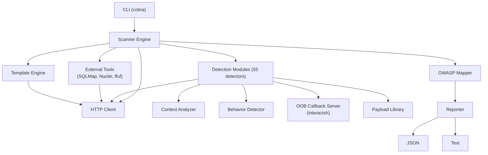
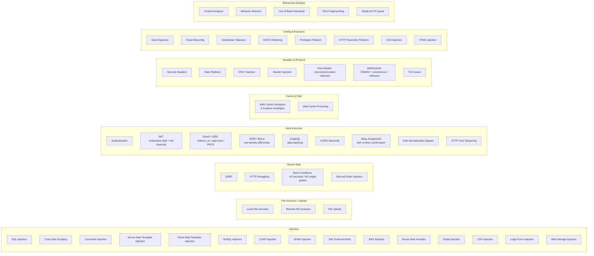
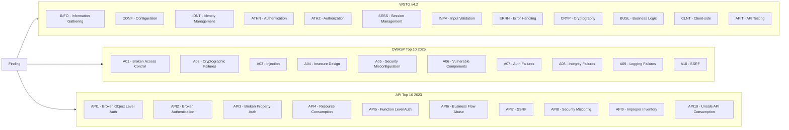

# SKWS - Swiss Knife for Web Security


A context-aware, behavior-based web security scanner. SKWS combines **55 native detection modules** — including a flagship layer of **template-resistant** primitives that no Nuclei template can replicate — with external tool integration, and maps every finding to OWASP frameworks (WSTG, Top 10 2025, API Top 10 2023).

**What makes this tool different from running Nuclei:** Nuclei templates are stateless pattern matchers — one request, one response, regex match → fire. They cover the breadth-of-known-CVEs case beautifully. They cannot do paired probes across two identities, transmission-synchronized HTTP/2 single-packet attacks, baseline-differential analysis, JWT forge-and-replay, two-phase mass-assignment confirmation, or anything else that needs *state*. SKWS uses Nuclei templates as a CVE library and adds native detector modules where templates structurally fall short.

## Architecture



## Features

- **55 native detection modules** covering injection, XSS, SSRF, misconfigurations, auth flaws, race conditions, cache deception, IDOR/BOLA, OAuth/OIDC, JWT forgery, WebSockets, GraphQL alias batching, and more
- **Template-resistant primitives** — paired-probe + analyzer + replay-confirmation patterns for bug classes Nuclei cannot detect (race conditions, cache deception, two-identity IDOR, mass-assignment with re-fetch, JWT forge-and-replay, GraphQL alias batching)
- **Context-aware detection** - analyzes reflection context, parameter types, and response behavior
- **Behavioral analysis** - detects anomalies through timing differentials and content analysis
- **Baseline-differential FP guards** - every flagship detector establishes a baseline and only fires on deviations the baseline never produced; eliminates noise from naturally-varying endpoints
- **Out-of-band testing** - blind vulnerability detection via interactsh callbacks shared across detectors
- **OWASP mapping** - every finding mapped to WSTG, Top 10 2025, and API Top 10 2023
- **External tool integration** - SQLMap, Nuclei, ffuf with normalized output
- **Template engine** - Nuclei-compatible template parser for the breadth-of-CVEs case
- **Technology fingerprinting** - wappalyzergo-based stack detection
- **Headless browser pool** - persistent Chromium pool for DOM-XSS, prototype-pollution, and CSP-aware checks
- **Burp Suite integration** - all native + template + WebSocket traffic forwards through `--proxy http://127.0.0.1:8080`
- **Multiple output formats** - JSON and text
- **Proxy support** - route traffic through Burp, ZAP, or any HTTP proxy

## Template-Resistant Detector Modules

Templates excel at "one request, regex match" detection. Bug-bounty-grade vulnerabilities increasingly need state, paired probes, and confirmation tiers. SKWS provides a curated set of native detectors built around a common contract:

> **establish baseline → run paired/staged probe → analyzer suppresses noise floor → optional confirmation tier promotes severity**

| Module | Primitive | Confirmation Path |
|---|---|---|
| `racecond` | HTTP/1.1 last-byte sync **and** HTTP/2 single-packet sync (Kettle-style); sequential baseline → synced burst → multi-success / duplicate-state analyzer | `Verifier` callback re-reads server-side state → Critical |
| `cachedeception` | 5 URL-mutation strategies (append-extension, path-segment, semicolon, encoded-null, trailing-slash) → Jaccard match against authed baseline | unauth replay returns the authed body → Critical |
| `idor.DetectCrossIdentity` | victim ground truth + attacker probe with separate auth contexts; Jaccard body-similarity | sensitive-pattern match in leaked body → Critical |
| `pathnorm` | 26 mutations across 5 strategy families; canonical 401/403 vs bypass status + body | admin-marker corpus hit → Critical |
| `jwt` (advanced) | embedded JWK forge (CVE-2018-0114-class) and kid path-traversal (`/dev/null` + empty HMAC); replay-only emission | server accepts forged token → Critical |
| `oauth` | OIDC discovery + 4 checks (redirect_uri bypass / id_token alg=none / missing PKCE / implicit flow) | live `/authorize` echoes attacker `redirect_uri` → High |
| `hosthdr` | Host / X-Forwarded-Host / X-Host probes; structured-location reflection check (Location, canonical, og:url, base, form action) | body-only echo doesn't trigger — pure FP guard |
| `ws` | CSWSH (hostile Origin upgrade), anonymous connect, message reflection via custom dialer | proxy/insecure plumbing mirrored from shared client |
| `graphql.DetectAliasBatching` | 100-aliased mutation in one request; per-alias execution count vs ground-truth single call | ≥80% aliases executed → Critical (rate-limit bypass) |
| `massassign.DetectWithReFetch` | POST with privileged field → GET profile re-fetch → `privilegeStuck` analyzer | confirmed via ground-truth state diff → Critical |

Every module ships with FP guards that pin the noise floor. For example: `cachedeception` won't flag bodies under 16 bytes, `racecond` ignores naturally-varying endpoints by comparing burst against sequential baseline, `pathnorm` won't flag SPAs that return the same forbidden body at status 200, `idor.DetectCrossIdentity` won't flag when the victim can't read their own resource (no ground truth).

## Scan Pipeline


## Installation

**Build from source:**

```bash
git clone https://github.com/swiss-knife-for-web-security/skws.git
cd skws
make build
```

**Install to GOPATH:**

```bash
make install
```

**Cross-platform builds:**

```bash
make build-all  # Linux, macOS (amd64+arm64), Windows
```

## Usage

```bash
# Basic scan
skws scan https://example.com/page?id=1

# POST request with data
skws scan -X POST -d "user=admin&pass=test" https://example.com/login

# Custom headers and cookies
skws scan -H "Authorization: Bearer token" --cookie "session=abc" https://example.com

# Aggressive scan (level 1-5, risk 1-3)
skws scan --level 5 --risk 3 https://example.com/page?id=1

# Through Burp Suite (all native + template + WebSocket traffic forwards)
skws scan --proxy http://127.0.0.1:8080 -k https://example.com

# Custom User-Agent
skws scan -A "Mozilla/5.0 (compatible; skws/1.0)" https://example.com

# JSON output
skws scan --json https://example.com > results.json

# Disable out-of-band testing
skws scan --no-oob https://example.com

# Verbose mode
skws scan -v https://example.com

# List and check external tools
skws tools list
skws tools check
```

### Flags

| Flag | Short | Description | Default |
|------|-------|-------------|---------|
| `--verbose` | `-v` | Enable verbose output | `false` |
| `--output` | `-o` | Output file path | stdout |
| `--proxy` | | Proxy URL (Burp/ZAP) — forwards all native, template, and WS traffic | |
| `--insecure` | `-k` | Skip TLS verification (required when proxying through Burp's MITM CA) | `false` |
| `--user-agent` | `-A` | Custom User-Agent | `SKWS/1.0` |
| `--timeout` | `-t` | Scan timeout | `30m` |
| `--concurrency` | `-c` | Concurrent tools | `3` |
| `--header` | `-H` | Custom header (repeatable) | |
| `--cookie` | | Cookie string | |
| `--data` | `-d` | POST data | |
| `--method` | `-X` | HTTP method | `GET` |
| `--level` | | Scan level (1-5) | `1` |
| `--risk` | | Risk level (1-3) | `1` |
| `--json` | | JSON output | `false` |
| `--no-oob` | | Disable OOB testing | `false` |

## Detection Modules



## OWASP Framework Mapping



## Output Formats

**Text** (default) - Human-readable report with severity breakdown, finding details, OWASP mappings, and remediation advice.

**JSON** (`--json`) - Structured output with all finding fields for programmatic consumption.

## Project Structure

```
cmd/skws/              Entry point and CLI commands
internal/
  core/                Core types (Finding, Target, EntryPoint, Severity)
  detection/           55 detection modules
    analysis/            Shared baseline / StripEcho primitive
    racecond/            H/1 last-byte + H/2 single-packet sync
    cachedeception/      Paired probe with unauth replay confirmation
    idor/                Single-identity ID-mutation + two-identity differential
    pathnorm/            26 mutations across 5 strategy families
    jwt/                 alg=none + RS->HS confusion + JWK forge + kid traversal
    oauth/               OIDC discovery + 4 spec-compliance checks
    hosthdr/             Structured-location reflection check
    ws/                  CSWSH + anonymous + reflection via custom dialer
    graphql/             Introspection + alias-batching rate-limit bypass
    massassign/          Field reflection + re-fetch confirmation
    oob/                 Interactsh client shared across detectors
    ...                  + 40 more modules
  headless/            Persistent Chromium pool (DOM-XSS, prototype-pollution)
  http/                HTTP client with proxy, TLS, and injection support
                       (Snapshot/ClientSnapshot for parallel transports)
  owasp/               WSTG, Top 10 2025, API Top 10 2023 mappers
  payloads/            Vulnerability payloads per category
  scanner/             Scan orchestration; split into _scan / _runners /
                       _urldetectors / _params / _oob / _tech files
  templates/           Nuclei-compatible template parser
  tools/               External tool wrappers (SQLMap, Nuclei, ffuf)
  reporting/           JSON and text report generation
tests/
  integration/         Integration tests (require tool binaries)
  e2e/                 End-to-end scan tests
configs/               Configuration files
data/                  Wordlists and fingerprints
benchmark/             Performance benchmarks
```

## Development

```bash
make build            # Build binary
make test             # Run unit tests
make test-cover       # Tests with coverage report
make test-race        # Tests with race detector
make test-integration # Integration tests
make test-e2e         # End-to-end tests
make lint             # Run golangci-lint
make fmt              # Format code
make vet              # Run go vet
make security         # Run gosec
make check            # All quality gates (fmt, vet, lint, security, test-race)
make bench            # Run benchmarks
```

### Quality Gates

| Gate | Threshold |
|------|-----------|
| Lint | Zero warnings |
| Vet | Zero issues |
| Security (gosec) | Zero high/critical |
| Tests | All pass |
| Coverage | >= 80% |
| Race detector | No races |
