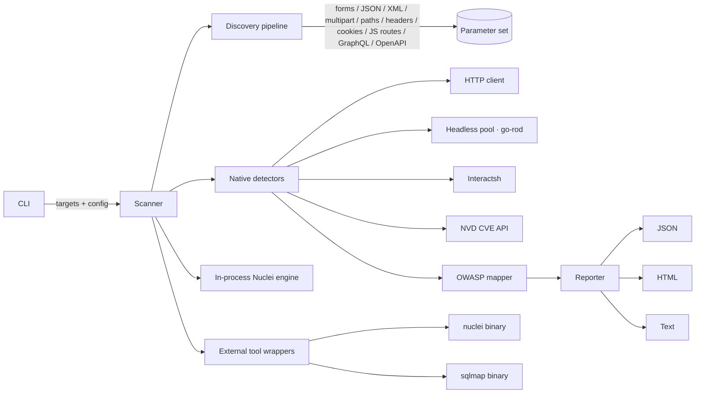

# skws — Swiss Knife for Web Security

[](go.mod)
[](https://goreportcard.com/report/github.com/TyrusRC/swiss-knife-for-web-security)
[](Makefile)
[](LICENSE)
[](https://github.com/TyrusRC/swiss-knife-for-web-security/commits/main)
[](https://github.com/TyrusRC/swiss-knife-for-web-security/issues)
[](#contributing)

A Go-native, CLI web-application security scanner that combines **80+
context-aware native detectors**, a **Nuclei-compatible template
engine**, optional **upstream tool integrations** (Nuclei binary,
SQLMap), and a **headless-browser pool** for DOM- and origin-aware
checks. Findings are mapped to OWASP **WSTG**, **Top 10 (2025)**, and
**API Security Top 10**.

skws focuses on the categories Nuclei templates structurally cannot
reach — stateful business-logic bugs, two-identity IDOR/BOLA, race
conditions over raw HTTP/2 frames, postMessage origin validation,
authenticated cache deception, and more — while reusing the upstream
Nuclei community template store for everything Nuclei already does
well.

> **Status:** pre-1.0. Detector defaults and the CLI surface may still
> shift between minor versions — pin a tag or commit if you depend on
> exact behavior.

---

## Table of contents

- [Why skws](#why-skws)
- [Quickstart](#quickstart)
- [Installation](#installation)
- [Usage](#usage)
- [Detection coverage](#detection-coverage)
- [Headless / two-identity probes](#headless--two-identity-probes)
- [External tool integrations](#external-tool-integrations)
- [Architecture](#architecture)
- [Project layout](#project-layout)
- [Development](#development)
- [Contributing](#contributing)
- [Security policy](#security-policy)
- [License](#license)

---

## Why skws

A scanner is only as good as the categories it can express. Nuclei is
excellent at fingerprint / CVE / regex-on-response checks, but it has
no JavaScript runtime, no session model, and no way to compare
behavior across two authenticated identities. skws fills exactly that
gap:

- **Two-identity IDOR / BOLA.** Probe the same URL with two different
  auth states and report when user A's response leaks to user B.
- **Race conditions** with H/1 last-byte synchronisation and H/2
  single-packet bursts (CVE-2023-44487-style raw-frame control).
- **Web cache deception** with optional unauthenticated replay
  verification.
- **Authenticated postMessage origin probe** that dispatches a
  synthetic `MessageEvent` from an attacker origin and watches which
  DOM/storage sinks the page's listeners mutated.
- **Smuggling, JWT cryptanalysis, OAuth/OIDC, GraphQL introspection,
  OpenAPI spec runner, second-order injection** — all stateful,
  multi-request flows.
- **Location-aware payload dispatch** (`SendPayloadAt`): JSON body,
  multipart, XML, path segment, header, and cookie injection points
  discovered by the auto-discovery pipeline are tested in the right
  transport, not silently shoved into the query string.

skws **runs Nuclei alongside** itself when the binary is on `PATH` —
you do not have to choose between the two.

---

## Quickstart

```sh
# install Go 1.24+ then:
git clone https://github.com/TyrusRC/swiss-knife-for-web-security.git
cd swiss-knife-for-web-security
make build

# scan a single URL
./bin/skws scan https://example.com/page?id=1

# stream multiple targets via stdin
cat targets.txt | ./bin/skws scan --json > findings.json

# two-identity IDOR / BOLA probe
./bin/skws scan https://app.example.com/account/123 \
  --auth-a-header "Authorization: Bearer alice-token" \
  --auth-b-header "Authorization: Bearer bob-token"

# proxy through Burp Suite, scan POST endpoint
./bin/skws scan -X POST -d "user=admin&pass=test" \
  --proxy http://127.0.0.1:8080 -k https://example.com/login

# inspect tool integrations
./bin/skws tools list
./bin/skws tools check
```

---

## Installation

### Requirements

- **Go 1.24+** to build from source.
- *(optional)* a Chromium-based browser for DOM-aware detectors and
  the postMessage probe — `go-rod` auto-downloads one on first use,
  or pass `--chrome-path` to use a system binary.
- *(optional)* `nuclei` and/or `sqlmap` on `PATH` to enable the
  external-tool wrappers. skws degrades gracefully when they are
  missing.

### From source

```sh
git clone https://github.com/TyrusRC/swiss-knife-for-web-security.git
cd swiss-knife-for-web-security
make build       # produces ./bin/skws
make install     # optional: install into $GOBIN
```

### `go install`

```sh
go install github.com/TyrusRC/swiss-knife-for-web-security/cmd/skws@latest
```

---

## Usage

```text
skws scan [target URL] [flags]
```

### Targets

- positional argument: `skws scan https://example.com`
- target list file: `skws scan -l targets.txt`
- piped from stdin: `cat targets.txt | skws scan`

### Authentication & transport

| Flag | Description |
|---|---|
| `-H, --header KEY:VAL` | Custom request header (repeatable) |
| `--cookie STRING` | `Cookie:` header value |
| `-A, --user-agent UA` | Custom User-Agent for ALL scanner traffic |
| `--proxy URL` | Proxy URL (HTTP CONNECT honored — Burp Suite friendly) |
| `-k, --insecure` | Skip TLS verification (needed when Burp/MitM uses its own CA) |
| `-d, --data STRING` | POST body (form-urlencoded by default) |
| `-X, --method METHOD` | HTTP method (default `GET`) |

### Scan shaping

| Flag | Description | Default |
|---|---|---|
| `-t, --timeout DURATION` | Total scan timeout | `30m` |
| `-c, --concurrency N` | Concurrent tools | `3` |
| `--profile NAME` | Scan profile (`quick`, `normal`, `thorough`) | |
| `--level 1-5` | SQLMap-style level | `1` |
| `--risk 1-3` | SQLMap-style risk | `1` |
| `--templates DIR` | Nuclei-style template directory | |
| `--api-spec URL` | OpenAPI/Swagger JSON; runner exercises every endpoint | |

### Output

| Flag | Description |
|---|---|
| `--json` | JSON to stdout |
| `--html` | HTML report to stdout |
| `-o, --output PATH` | Output directory for tool artifacts |
| `-v, --verbose` | Verbose progress on stderr |

### Two-identity IDOR / BOLA

| Flag | Description |
|---|---|
| `--auth-a-cookie STRING` | Cookie header for identity A (the "victim") |
| `--auth-b-cookie STRING` | Cookie header for identity B (the "attacker") |
| `--auth-a-header KEY:VAL` | Per-identity-A header (repeatable) |
| `--auth-b-header KEY:VAL` | Per-identity-B header (repeatable) |
| `--idor-url URL` | Override URL for the cross-identity probe |

### External tools

| Flag | Description |
|---|---|
| `--no-nuclei` | Skip the Nuclei binary even when it's on `PATH` |
| `--nuclei-tags LIST` | Tag filter forwarded to Nuclei (`cve,rce`) |
| `--nuclei-severity LIST` | Severity filter (`high,critical`) |

### Headless / DOM

| Flag | Description |
|---|---|
| `--chrome-path PATH` | Explicit Chrome/Chromium binary |
| `--storage-inj` | Enable client-side storage injection probes |
| `--no-postmessage` | Disable the postMessage origin-validation probe |

### Per-detector toggles

Disable any detector with `--no-<name>`. Highlights:

`--no-csrf`, `--no-tabnabbing`, `--no-jsdep`, `--no-data-exposure`,
`--no-admin-path`, `--no-api-version`, `--no-content-type`, `--no-sse`,
`--no-grpc-reflect`, `--no-prompt-injection`, `--no-xslt`,
`--no-saml-injection`, `--no-orm-leak`, `--no-type-juggling`,
`--no-dep-confusion`, `--no-token-entropy`, `--no-cache-deception`,
`--no-cache-poisoning`, `--no-css-injection`, `--no-deserialization`,
`--no-dom-clobber`, `--no-email-injection`, `--no-hpp`,
`--no-html-injection`, `--no-second-order`, `--no-ssi`, `--no-storage`,
`--no-discovery`, `--no-oob`.

Aggressive probes are **opt-in** (mutate state or send heavy traffic):

`--rate-limit`, `--redos`, `--h2-reset`, `--mass-assign`,
`--proto-pollution-server`.

`--nvd-api-key KEY` (or `NVD_API_KEY` env) raises the NVD CVE lookup
limit from ~5 to ~50 requests / 30 seconds for the JS-dependency
detector.

---

## Detection coverage

Native detectors mapped to OWASP WSTG / Top 10 / API Top 10 / CWE.
Each finding ships with all four mappings.

### Injection
SQLi (error-based + boolean-blind), XSS, CMDi, SSTI (multi-engine —
Jinja2 / Twig / Freemarker / Velocity / Mako / Smarty / ERB / Java),
CSTI, NoSQL, LDAP, XPath, XXE (param + URL-level POST), JNDI / Log4Shell,
SSI, email-header (CRLF in mail headers), CSV / formula, login-form,
web-storage, XSLT, HTML / CSS / DOM-clobber injection.

### File handling
LFI (with PHP wrappers), RFI, file upload (MIME / double-ext /
null-byte bypass).

### Server-side
SSRF with cloud-metadata for AWS / Azure / GCP / Alibaba / Tencent /
IBM / Oracle / IPv6, HTTP request smuggling, race conditions
(H/1 last-byte sync + H/2 single-packet), second-order injection,
HTTP/2 rapid-reset (CVE-2023-44487, opt-in).

### Auth & access
JWT cryptanalysis (alg=none / RS→HS / embedded JWK / kid traversal /
lifetime / weak-secret dict), OAuth/OIDC discovery audit, **two-identity
IDOR / BOLA**, single-identity IDOR with numeric / UUID / hex
mutation, CORS, mass-assignment with re-fetch verification, path
normalization, verb tampering, SAML SP envelope (XSW + comment
injection), PHP type-juggling auth bypass, CSRF.

### Cache
Web cache deception with unauth-replay verification, web cache
poisoning via unkeyed-header reflection.

### Headers / protocol
Security headers, open redirect, CRLF, header injection,
host-header reflection, WebSocket (CSWSH / reflection),
Server-Sent Events auth, gRPC reflection, TLS configuration,
reverse-tabnabbing.

### Config / exposure
Sensitive file exposure, cloud misconfig, subdomain takeover,
DOM clobbering, server-side prototype pollution (opt-in), HPP,
admin / debug path probe, content-type confusion.

### API surfaces
OpenAPI spec runner (auth-bypass + undocumented verbs), API version
enumeration, ORM expansion / over-fetch, JSON sensitive-field
analyzer, rate-limit burst probe (opt-in), GraphQL (introspection /
alias batching / depth bomb / field suggestion).

### DOM-aware (headless)
DOM-XSS, client-side prototype pollution, DOM-based open redirect,
client storage injection, **postMessage origin validation**.

### Modern / niche
LLM prompt injection, ReDoS timing probe (opt-in), dependency-
confusion manifest leak, insecure-token entropy / sequential-id
detector.

### Components
JS dependencies parsed from `<script src>` and queried against the
[NVD CVE API](https://nvd.nist.gov/developers/vulnerabilities) for
per-version CVE matches.

### Out-of-band
Blind detection via shared
[interactsh](https://github.com/projectdiscovery/interactsh) callback
server — XXE, SSRF, CMDI, RFI, ReDoS, second-order all participate.

---

## Headless / two-identity probes

Two capabilities deserve special call-out because they are
structurally beyond Nuclei templates:

### `postMessage` origin probe
Navigates a target in a real browser, dispatches a synthetic
`MessageEvent` claiming an attacker origin, then diffs DOM / storage
sinks. Listeners that mutated `innerHTML` / `location` / `localStorage`
/ `sessionStorage` / `documentCookie` without validating
`event.origin` are reported with severity graded by which sink
was reached.

```sh
skws scan --no-postmessage=false https://app.example.com/
```

### Two-identity IDOR / BOLA
Constructs two HTTP clients carrying distinct auth state and probes
the same URL with each. When identity B's response carries a body
similar (Jaccard ≥ 0.85) to identity A's private response — and
contains sensitive-data markers — emit a Critical finding. Otherwise
High when the unauthorised access is confirmed, Medium when only the
application precondition is observed.

```sh
skws scan https://api.example.com/v1/users/42 \
  --auth-a-cookie "session=alice" \
  --auth-b-cookie "session=bob"
```

---

## External tool integrations

skws ships in-process implementations for everything in
[Detection coverage](#detection-coverage); the external wrappers are
opt-in additions for breadth.

| Tool | Status | Purpose |
|---|---|---|
| **Nuclei** | wrapped (`internal/tools/nuclei`) | Runs upstream community templates with `-jsonl`; findings parsed into the unified report |
| **SQLMap** | wrapped (`internal/tools/sqlmap`) | Deep SQL-injection exploitation when in-process error / boolean-blind isn't enough |
| ffuf | TODO | Path / parameter brute-force |
| nikto | TODO | Legacy fingerprint scan |

`skws tools list` shows availability and version of each. `skws tools
check` runs a health check and prints a green/red status. Missing
binaries are not fatal — the scan proceeds without them.

---

## Architecture



The orchestrator dispatches in three phases:

1. **Discovery** — enumerate every injectable surface from response
   bodies, headers, cookies, and the OpenAPI spec when supplied.
2. **Parameter-injection** — for each discovered parameter, run only
   the detectors that make sense for its `Location` (query/body/path/
   header/cookie/storage). `SendPayloadAt` dispatches into the
   correct transport.
3. **URL-level** — IDOR, two-identity BOLA, CORS, smuggling, race,
   cache deception, postMessage probe, JWT, OAuth, GraphQL, the
   OpenAPI runner, and ~30 more, all in parallel goroutines.

OOB callbacks confirm blind cases (XXE, SSRF, CMDI, second-order)
asynchronously after the synchronous phases.

---

## Project layout

```
cmd/skws/                        CLI entry point (Cobra)
internal/
  core/                          Finding, Target, Severity, Parameter
  detection/<module>/            Per-detector packages (one per category)
  discovery/                     Auto-discovery pipeline (form, JSON, XML, multipart, OpenAPI, …)
  headless/                      Rod-backed browser pool + DOM probes
  http/                          HTTP client with location-aware payload dispatch
  owasp/                         WSTG / Top-10 / API-Top-10 mappers
  payloads/                      Payload data per category
  reporting/                     JSON / HTML / text reporters
  scanner/                       Scan orchestration (split into category submodules)
  templates/                     Nuclei-compatible template engine
  tools/                         External tool wrappers (sqlmap, nuclei)
configs/                         Default configurations
data/                            Wordlists and fingerprints
docs/                            Specs and design notes
```

CLAUDE.md sets a 500-line per-source-file ceiling; refactor when a
file grows past it.

---

## Development

```sh
make build              # produce bin/skws
make test               # unit tests
make test-short         # skip integration / network-bound tests
make test-race          # tests with -race
make test-cover         # coverage report
make test-integration   # requires sqlmap / nuclei / ffuf binaries
make test-e2e           # end-to-end scans
make lint               # golangci-lint
make fmt                # go fmt + gofumpt
make vet                # go vet
make security           # gosec
make check              # fmt + vet + lint + security + race  (run before PR)
make bench              # benchmarks
```

### Contributing detector tests

This project follows **strict TDD** (CLAUDE.md). Write the failing
test first; never add production code without a covering test. New
detectors should:

- Live under `internal/detection/<module>/` with `detector.go`,
  `detector_test.go`, `doc.go`.
- Implement the same shape as existing detectors (constructor takes
  `*internal/http.Client`, `Detect(ctx, target, opts)` returns
  `*DetectionResult`).
- Map each finding to `WSTG-…`, `A0X:2025`, optional `APIX:2023`, and
  the relevant CWE via `Finding.WithOWASPMapping`.
- Be wired into `internal/scanner/runner_url.go` (URL-level) or
  `internal/scanner/runner_param.go` (parameter-level), and gated
  behind an `Enable<X>` flag in `InternalScanConfig`.

---

## Contributing

Issues and pull requests are welcome.

1. **Fork** and create a feature branch (`feature/<short-name>` or
   `fix/<short-name>`).
2. **Write tests first** — every PR must keep `make check` green and
   uphold the 80%+ coverage threshold for security-critical
   packages (`internal/detection/`, `internal/http/`).
3. **One detector per PR** keeps reviews tractable.
4. **No co-author trailers other than yourself**; don't reference
   AI tools in commit messages.
5. **Conventional Commits** (`feat:`, `fix:`, `refactor:`, `test:`,
   `docs:`, `chore:`) — see `git log` for in-repo style.

Run `make check` locally before opening a PR.

---

## Security policy

skws is a defensive security tool. **Use it only against systems you
own or have explicit written authorisation to test.** Unauthorised
scanning is illegal in most jurisdictions.

If you find a security issue *in skws itself* (not in a target), open
a private GitHub Security Advisory rather than a public issue.

---

## License

Licensed under the Apache License, Version 2.0. See [LICENSE](LICENSE)
for the full text.
