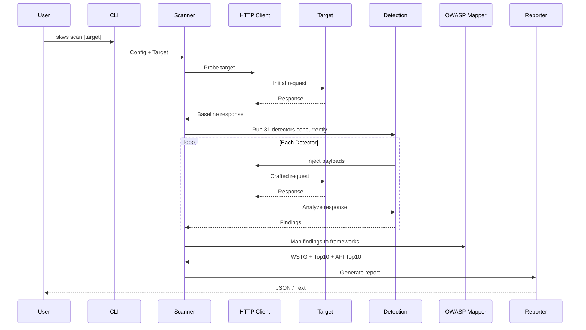
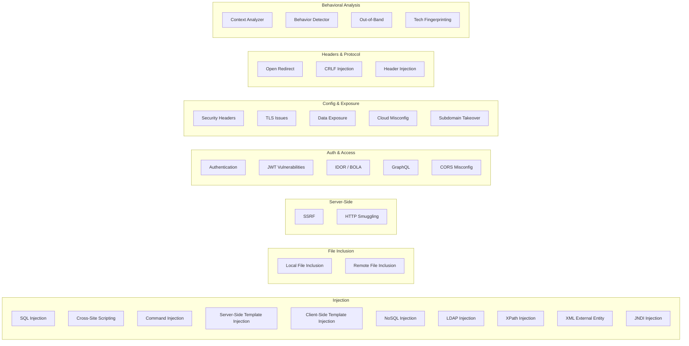

# SKWS - Swiss Knife for Web Security


A context-aware, behavior-based web security scanner. SKWS combines 31 built-in detection modules with external tool integration and maps every finding to OWASP frameworks (WSTG, Top 10 2021, API Top 10 2023).

## Architecture


## Features

- **31 detection modules** covering injection, XSS, SSRF, misconfigurations, auth flaws, and more
- **Context-aware detection** - analyzes reflection context, parameter types, and response behavior
- **Behavioral analysis** - detects anomalies through timing differentials and content analysis
- **Out-of-band testing** - blind vulnerability detection via interactsh callbacks
- **OWASP mapping** - every finding mapped to WSTG, Top 10 2021, and API Top 10 2023
- **External tool integration** - SQLMap, Nuclei, ffuf with normalized output
- **Template engine** - extensible Nuclei-style templates for custom checks
- **Technology fingerprinting** - wappalyzergo-based stack detection
- **Multiple output formats** - JSON and text
- **Proxy support** - route traffic through Burp, ZAP, or any HTTP proxy

## Scan Pipeline



## Installation

**Build from source:**

```bash
git clone https://github.com/swiss-knife-for-web-security/skws.git
cd skws
make build
```

**Install to GOPATH:**

```bash
make install
```

**Cross-platform builds:**

```bash
make build-all  # Linux, macOS (amd64+arm64), Windows
```

## Usage

```bash
# Basic scan
skws scan https://example.com/page?id=1

# POST request with data
skws scan -X POST -d "user=admin&pass=test" https://example.com/login

# Custom headers and cookies
skws scan -H "Authorization: Bearer token" --cookie "session=abc" https://example.com

# Aggressive scan (level 1-5, risk 1-3)
skws scan --level 5 --risk 3 https://example.com/page?id=1

# Through a proxy
skws scan --proxy http://127.0.0.1:8080 https://example.com

# JSON output
skws scan --json https://example.com > results.json

# Disable out-of-band testing
skws scan --no-oob https://example.com

# Verbose mode
skws scan -v https://example.com

# List and check external tools
skws tools list
skws tools check
```

### Flags

| Flag | Short | Description | Default |
|------|-------|-------------|---------|
| `--verbose` | `-v` | Enable verbose output | `false` |
| `--output` | `-o` | Output file path | stdout |
| `--proxy` | | Proxy URL | |
| `--timeout` | `-t` | Scan timeout | `30m` |
| `--concurrency` | `-c` | Concurrent tools | `3` |
| `--header` | `-H` | Custom header (repeatable) | |
| `--cookie` | | Cookie string | |
| `--data` | `-d` | POST data | |
| `--method` | `-X` | HTTP method | `GET` |
| `--level` | | Scan level (1-5) | `1` |
| `--risk` | | Risk level (1-3) | `1` |
| `--json` | | JSON output | `false` |
| `--no-oob` | | Disable OOB testing | `false` |

## Detection Modules



## OWASP Framework Mapping


## Output Formats

**Text** (default) - Human-readable report with severity breakdown, finding details, OWASP mappings, and remediation advice.

**JSON** (`--json`) - Structured output with all finding fields for programmatic consumption.

## Project Structure

```
cmd/skws/              Entry point and CLI commands
internal/
  core/                Core types (Finding, Target, EntryPoint, Severity)
  detection/           31 detection modules
  http/                HTTP client with proxy, TLS, and injection support
  owasp/               WSTG, Top 10, API Top 10 mappers
  payloads/            Vulnerability payloads per category
  scanner/             Scan orchestration and concurrency
  templates/           Nuclei-style template engine
  tools/               External tool wrappers (SQLMap, Nuclei, ffuf)
  reporting/           JSON and text report generation
tests/
  integration/         Integration tests (require tool binaries)
  e2e/                 End-to-end scan tests
configs/               Configuration files
data/                  Wordlists and fingerprints
benchmark/             Performance benchmarks
```

## Development

```bash
make build            # Build binary
make test             # Run unit tests
make test-cover       # Tests with coverage report
make test-race        # Tests with race detector
make test-integration # Integration tests
make test-e2e         # End-to-end tests
make lint             # Run golangci-lint
make fmt              # Format code
make vet              # Run go vet
make security         # Run gosec
make check            # All quality gates (fmt, vet, lint, security, test-race)
make bench            # Run benchmarks
```

### Quality Gates

| Gate | Threshold |
|------|-----------|
| Lint | Zero warnings |
| Vet | Zero issues |
| Security (gosec) | Zero high/critical |
| Tests | All pass |
| Coverage | >= 80% |
| Race detector | No races |
