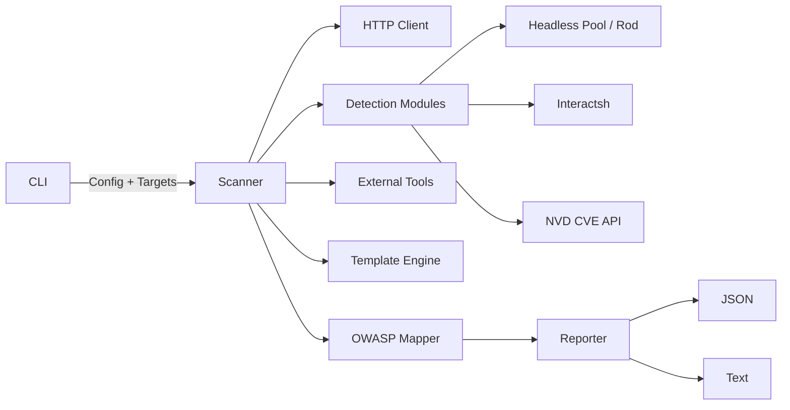

# skws

[](go.mod)
[](https://goreportcard.com/report/github.com/TyrusRC/swiss-knife-for-web-security)
[](LICENSE)
[](https://github.com/TyrusRC/swiss-knife-for-web-security/commits/main)

Swiss Knife for Web Security — a CLI web-application security scanner written in Go.
Combines context-aware native detectors, a Nuclei-compatible template engine,
external tool integrations (SQLMap, Nuclei, ffuf), and a headless browser pool
for DOM-aware checks.

Findings are mapped to the OWASP Web Security Testing Guide (WSTG), Top 10,
and API Security Top 10.

## Status

Pre-release. APIs and detector defaults may change.

## Requirements

- Go 1.24 or newer to build
- Optional: SQLMap, Nuclei, and ffuf binaries on `PATH` for the matching
  external integrations
- A headless browser is auto-downloaded by [go-rod](https://github.com/go-rod/rod)
  on first use; pass `--chrome-path` to use a system binary instead

## Installation

```sh
git clone https://github.com/TyrusRC/swiss-knife-for-web-security.git
cd swiss-knife-for-web-security
make build
```

The binary is produced at `bin/skws`.

## Usage

```sh
# Scan a single URL
skws scan https://example.com/page?id=1

# Multiple targets from file or stdin
skws scan -l targets.txt
cat targets.txt | skws scan

# POST endpoint
skws scan -X POST -d "user=admin&pass=test" https://example.com/login

# Custom auth
skws scan -H "Authorization: Bearer $TOKEN" --cookie "session=..." https://example.com

# Through Burp Suite or another intercepting proxy
skws scan --proxy http://127.0.0.1:8080 -k https://example.com

# JSON output
skws scan --json https://example.com > findings.json

# List or check external tools
skws tools list
skws tools check
```

### Flags

| Flag | Short | Description | Default |
|---|---|---|---|
| `--verbose` | `-v` | Verbose progress output | `false` |
| `--output` | `-o` | Output file path | stdout |
| `--proxy` | | Proxy URL forwarded to native, template, and WebSocket traffic | |
| `--insecure` | `-k` | Skip TLS verification (required when an intercepting proxy uses its own CA) | `false` |
| `--user-agent` | `-A` | Custom User-Agent | `SKWS/1.0` |
| `--timeout` | `-t` | Scan timeout | `30m` |
| `--concurrency` | `-c` | Concurrent tools | `3` |
| `--header` | `-H` | Custom header (repeatable) | |
| `--cookie` | | Cookie string | |
| `--data` | `-d` | POST data | |
| `--method` | `-X` | HTTP method | `GET` |
| `--level` | | Scan level (1-5) | `1` |
| `--risk` | | Risk level (1-3) | `1` |
| `--json` | | JSON output | `false` |
| `--no-oob` | | Disable out-of-band testing | `false` |
| `--no-discovery` | | Disable parameter auto-discovery | `false` |
| `--no-jsdep` | | Disable JS dependency / NVD CVE lookup | `false` |
| `--nvd-api-key` | | NVD API key (env fallback: `NVD_API_KEY`) | |
| `--storage-inj` | | Enable client-side storage injection probes (headless) | `false` |
| `--chrome-path` | | Explicit Chrome/Chromium binary | auto-download |
| `--templates` | | Path to Nuclei template directory | |
| `--profile` | | Scan profile (`quick`, `normal`, `thorough`) | |
| `--list` | `-l` | Read targets from file | |
| `--api-spec` | | OpenAPI / Swagger JSON URL — runner exercises every documented endpoint | |
| `--rate-limit` | | Burst-probe for missing rate limits (~12 fast requests; opt-in) | `false` |
| `--redos` | | Enable ReDoS timing probe (opt-in, adds latency on regex-shaped params) | `false` |
| `--h2-reset` | | Probe HTTP/2 rapid-reset (CVE-2023-44487; opt-in, sends raw H/2 frames) | `false` |
| `--no-data-exposure`, `--no-admin-path`, `--no-api-version`, `--no-content-type`, `--no-sse`, `--no-grpc-reflect`, `--no-csrf`, `--no-tabnabbing`, `--no-prompt-injection`, `--no-xslt`, `--no-saml-injection`, `--no-orm-leak`, `--no-type-juggling`, `--no-dep-confusion`, `--no-token-entropy` | | Per-detector off-switches | |

## Detection coverage

Native detectors are grouped below. Each is mapped to WSTG, OWASP Top 10,
API Top 10, and CWE in its findings.

| Category | Detectors |
|---|---|
| Injection | SQLi (error-based and boolean-blind), XSS, CMDi, SSTI, CSTI, NoSQL, LDAP, XPath, XXE (param + URL-level POST), JNDI, SSI, email, CSV, login-form, web-storage, XSLT |
| File handling | LFI, RFI, file upload |
| Server-side | SSRF (with cloud-metadata for AWS / Azure / GCP / Alibaba / Tencent / IBM / Oracle / IPv6), HTTP request smuggling, race conditions (H/1 last-byte and H/2 single-packet), second-order, HTTP/2 rapid-reset (CVE-2023-44487, opt-in) |
| Auth and access | JWT (alg=none / RS→HS / embedded JWK / kid traversal / lifetime audit), OAuth/OIDC, IDOR/BOLA (single- and two-identity), CORS, mass assignment with re-fetch, path normalization, verb tampering, SAML SP envelope (XSW + comment injection), type-juggling auth bypass, CSRF |
| Cache | Web cache deception, web cache poisoning |
| Headers / protocol | Security headers, open redirect, CRLF, header injection, host-header reflection, WebSockets (CSWSH / reflection), SSE auth, gRPC reflection, TLS configuration, reverse-tabnabbing |
| Config / exposure | Sensitive file exposure, cloud misconfig, subdomain takeover, DOM clobbering, prototype pollution, HPP, CSS/HTML injection, admin / debug path probe, content-type confusion |
| API surfaces | OpenAPI spec runner (auth-bypass-on-spec + undocumented verbs), API version enumeration, sibling /v0 / legacy / beta probe, ORM expansion / over-fetch, JSON sensitive-field analyzer, rate-limit burst probe (opt-in), GraphQL (introspection / alias batching / depth bomb / field suggestion) |
| DOM-aware (headless) | DOM-based XSS, client-side prototype pollution, DOM-based open redirect, client storage injection |
| Modern / niche | LLM prompt injection, ReDoS timing probe (opt-in), dependency-confusion manifest leak, insecure-token entropy / sequential-id detector |
| Components | JS dependencies parsed from `<script src>` and queried against the [NVD CVE API](https://nvd.nist.gov/developers/vulnerabilities) |
| Out-of-band | Blind detection via shared [interactsh](https://github.com/projectdiscovery/interactsh) callback server |

## Architecture



## NVD lookups

The `jsdep` detector identifies common JavaScript libraries from
`<script src=...>` URLs, builds a CPE 2.3 application name, and queries the
NVD CVE API for matching vulnerabilities.

- Anonymous: roughly 5 requests per 30 seconds.
- Authenticated: roughly 50 requests per 30 seconds. Pass `--nvd-api-key`
  or set `NVD_API_KEY`.

The client paces requests below the documented limit so a scan does not
trigger throttling.

## Project layout

```
cmd/skws/              CLI entry point and Cobra commands
internal/
  core/                Finding, Target, Severity, EntryPoint
  detection/           Per-module detectors (one directory each)
  headless/            Rod-backed browser pool
  http/                HTTP client with proxy / TLS / injection helpers
  owasp/               WSTG and Top-10 mappers
  payloads/            Payload data per category
  scanner/             Scan orchestration
  templates/           Nuclei-compatible template engine
  tools/               External tool wrappers
  reporting/           JSON and text reporters
tests/                 Integration and end-to-end tests
configs/               Default configuration files
data/                  Wordlists and fingerprints
```

## Development

```sh
make build              # Build bin/skws
make test               # Unit tests
make test-race          # Tests with -race
make test-cover         # Coverage report
make test-integration   # Requires SQLMap / Nuclei / ffuf
make test-e2e           # End-to-end scan tests
make lint               # golangci-lint
make fmt                # go fmt + gofumpt
make vet                # go vet
make security           # gosec
make check              # fmt + vet + lint + security + race
make bench              # Benchmarks
```

## Output

Text is the default reporter; pass `--json` for structured output suitable
for piping into other tools or storing as scan artifacts.

## Contributing

Issues and pull requests are welcome. Please run `make check` before opening
a PR. New detectors should ship with unit tests using table-driven cases
where practical.

## License

Licensed under the Apache License, Version 2.0. See [LICENSE](LICENSE) for the
full text.
